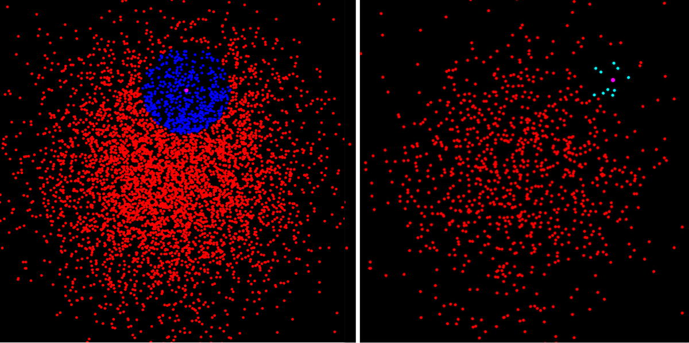

Data inside each colored patch is retrieved in a single I/O operation. This pattern of "localized data access" extends
to high dimensional space.

# The DistanceTree Project

This project provides a _Scalable, Durable_ `DistanceTree`.

---

## What does a `DistanceTree` do?

> A `DistanceTree` allows you to find _similar_ data in **high-dimensional datasets**.

The `DistanceTree` combines aspects of the `B-Tree` and the `M-Tree`. The `DistanceTree` uses aspects of the `B-Tree` to
minimize the I/O required to get data from durable storage. The `DistanceTree` uses aspects of the `M-Tree` (i.e.
MetricTree) to optimize searching data embedded in high-dimensional space.

Prior to this project a
`MetricTree`  [(see here)](https://github.com/mitre-public/commons/blob/main/src/main/java/org/mitre/caasd/commons/collect/MetricTree.java)
was **_just_** an in-memory data structure. This project adapts `MetricTree's` implementation into a `DistanceTree`
whose data can persist beyond the lifetime is a single JVM process. The _data storage layer_ backing a `DistanceTree` is
a fully plug-able component. Each _data storage layer_ (e.g., local files on disk, DuckDB, ScyllaDB, RDS, etc.) will
have different performance, durability, and dollar cost characteristics. This project allows the user to choose which
_data storage solution_ they want to use.

---

## Goal = Support These Queries

- **Range Query:** `getAllWithinRange(K searchKey, double range)` (left side of graphic)
- **kNN Query:** `getNClosest(K searchKey, int n)` (right side of graphic, k = 10)



---

## Usage

### First, Add this dependency to your project

```
GRADLE:
dependencies {
  implementation("org.mitre:dist-tree:X.Y.Z")
}

MAVEN:
<dependency>
    <groupId>org.mitre</groupId>
    <artifactId>dist-tree</artifactId>
    <version>X.Y.Z</version>
</dependency>
```

### Second, indexing a dataset for search

``` 
// Building an DistanceTree starts with a TreeConfig
DistanceTree<LatLong, String> tree = TreeConfig.<LatLong, String>builder()
    .keySerde(latLongSerde())
    .valueSerde(stringUtf8Serde())
    .distMetric((a, b) -> a.distanceTo(b).inNauticalMiles())
    .buildTree();

// Gather the Key-Value data we want to store in the tree
List<LatLong> locations = loadBusinessLocations();
List<String> names = loadBusinessNames();
tree.addBatches(batchify(locations, names, 1_000));

// --- JVM is shutdown, but the indexed dataset is persisted!
```

### Third, Searching the Dataset

```
// The next JVM loads the tree from the default DataStore
DistanceTree<LatLong, String> tree = TreeConfig.<LatLong, String>builder()
    .keySerde(latLongSerde())
    .valueSerde(stringUtf8Serde())
    .distMetric((a, b) -> a.distanceTo(b).inNauticalMiles())
    .buildTree();

// No manual data loading is necessary

// Perform a "range search"
LatLong searchKey = randomLatLong();
double searchRadiusNm = 0.5;
SearchResults<LatLong, String> businessesNearby = tree.rangeSearch(searchKey, searchRadiusNm);

// Perform a "knn search"
SearchResults<LatLong, String> fiveClosestBusinesses = tree.knnSearch(searchKey, 5);
```

---

## Data Durability Options

A DistanceTree stores Key-Value pairs (i.e. `Tuples`) and make those KV pairs searchable. The physical data storage
solution is represented by the `DataStore` interface. Different implementations of `DataStore` provide different levels
of speed, latency, and reliability.

There are two pre-packaged `DataStore` implementations. Select a DataStore, and receive the performance vs.
reliability trade-off that `DataStore` makes.  (Hopefully, more `DataStore` implementation will be coming soon.)

The available DataStores are:

- `DuckDbStore`: This is the default `DataStore` implementation.
    - **Pros:** [DuckDB](https://duckdb.org/) is a well adopted, open-source database system that runs "in-process" on
      locally stored data. DuckDB's core thesis is that modern computers are powerful enough that many database-ish
      tasks can now occur locally. The overhead and complexity of a remote, sharded, and replicated database may not be
      necessary. In other words, DuckDB is simple. And using DuckDB to persist data and manage I/O means DistanceTree
      users do not need to integrate with a separate data storage service (other than the local disk).
    - **Cons:** This `DataStore` does not benefit from reliability improving features like redundant components, data
      replication, and load balancing.
- `InMemoryStore`: This DataStore is fast. It does not perform I/O. All data is kept in memory.
    - **Pros:** Fast! Great for problems that do not need persistent data storage.
    - **Cons:** Does not persist data.

---

## What is a _"Metric Space"_

- A [Metric Space](https://en.wikipedia.org/wiki/Metric_space) is a _"math-nerdy"_ algebraic construct.
- **In a nutshell, you can measure the distance between any two items _in a metric space_.**
- This means the Keys, `<K>`, used in these Key-Value pairs are "embedded in a metric space"
- It also means, the `DistanceMetric<K>` defines the metric space because it measures the distance between **any** two
  keys "in the space"
    - Be careful, a `DistanceMetric` that defines a metric space has a strict algebraic definition, **DO NOT** get this
      wrong.
    - Specifically, a `DistanceMetric` function `d(K key1, K key2)` MUST obey these rules:
        1. `d(x,y) >= 0`
        2. `d(x,y) = d(y,x)`
        3. `d(x,z) <= d(x,y) + d(y,z)`
        4. (Optional rule) `d(x,y) = 0 if and only if x = y`
- A `Metric Space` is essentially the _"next best thing"_ when you want to sort & search data that has too many
  dimensions to correctly search with a 1-dimensional ordering. For example, `LatLong` data is 2-dimensional. If you
  sort by Latitude you'll sometime wish you had sorted by longitude (and vice versa). However, you can use the distance
  metric defining a Metric Space to sort by "distance between `LatLong` points". Now you can binary search using "closer
  together" and "further apart" in place of "greater than" and "less than".
- In other words, if you can "measure the distance between Keys" you can binary search Key-Value pairs backed by those
  keys.

---

## Types of Data that Can be Searched in a `DistanceTree`

1. `Latitude Longitude data`
    - This _simple_ 2-d data.
    - DistanceMetric = `latLong1.distanceTo(latLong2).in(myFavoriteUnit);`
2. `4-d position data`
    - (x, y, z, t)
    - The distance between any two positions will be function of true distance AND time.
    - A distance function can weight time & distance as needed.
    - For example, as distance function can ignore time completely OR a distance function can enforce data to be in
      the "same place at the same time"
3. `Position Paths`
    - e.g. `(x, y, z, t)_1`, `(x, y, z, t)_2`, `(x, y, z, t)_3`, `(x, y, z, t)_4`, ...
    - The distance (e.g. difference) between any two paths can be measured.
    - This means we can easily search for "similar paths" using a `DistanceTree`
4. `Time Series curves`
5. `Probabilty Mass Functions`
    - [Kullback–Leibler Divergence](https://en.wikipedia.org/wiki/Kullback%E2%80%93Leibler_divergence)
6. `Markov Transition Matrices`
7. `Audio Signals`
    - Compute the FFT of an audio signal
    - Distance function = "Earth mover distance(FFT_1, FFT_2)"
8. `DNA Sequences`
    - Distance Metric = [Levenshtein Distance](https://en.wikipedia.org/wiki/Levenshtein_distance) btw two DNA strings
    - This defines a proper Metric Space!

---

## Documentation

- **Performance:** A discussion on how Tree Configuration choices can impact performance
  is [here](./docs/dimensions-of-performance.md).
- **Frequently Asked Questions:** are listed [here](./docs/FAQs.md).
- **Storing Nodes, Tuples, and Pages:** is discussed [here](./docs/nodes-and-pages.md).
- **Goals and Non-Goals:** are discussed [here](./docs/goals-and-nongoals.md).
- **Possible future optimizations:** Are discussed [here](./docs/future-optimizations.md).

---

## Contributing

Contributions are welcomed and encouraged. We are currently looking for contributions that:

- Implement any of these [future optimizations](./docs/future-optimizations.md)
- Add `DataStore` implementations backed by: `PostgreSQL`, `SQLite`, or other data storage platforms

---

## Related Research

**Highly Related Research:**

- ["M-tree An Efficient Access Method for Similarity Search in Metric Spaces"](https://www.vldb.org/conf/1997/P426.PDF)
    - The most relevant paper by Paolo Ciaccia, Marco Patella, and Pavel Zezula
- ["Indexing Metric Spaces with M-tree"](http://www-db.deis.unibo.it/research/papers/SEBD97.pdf)
    - By: Paolo Ciaccia, Marco Patella, and Pavel Zezula
- ["An implementation of the M-tree index structure for PostgreSQL using GiST](https://ieeexplore.ieee.org/stamp/stamp.jsp?tp=&arnumber=9119265)
    - By István Donkó, János M. Szalai-Gindl, Gergo Gombos, and Attila Kiss

**Related Research:**

- [PostgreSQL GiST extension](https://www.postgresql.org/docs/8.1/gist.html)
- [pgvector](https://github.com/pgvector/pgvector)
- [faiss](https://github.com/facebookresearch/faiss/wiki)
    - This repo contains links to many other academic references

---

## Legal Statements

- **Approved for Public Release; Distribution Unlimited. Public Release Case Number 25-1212.**
- **Copyright:** The contents of this project is copyright `The MITRE Corporation`. See details [here](COPYRIGHT) .
- **Open Source License:** This project is released under the Apache License Version 2.0. See details [here](LICENSE).
- **Data Rights Legend:** See details [here](DATA_RIGHTS).
