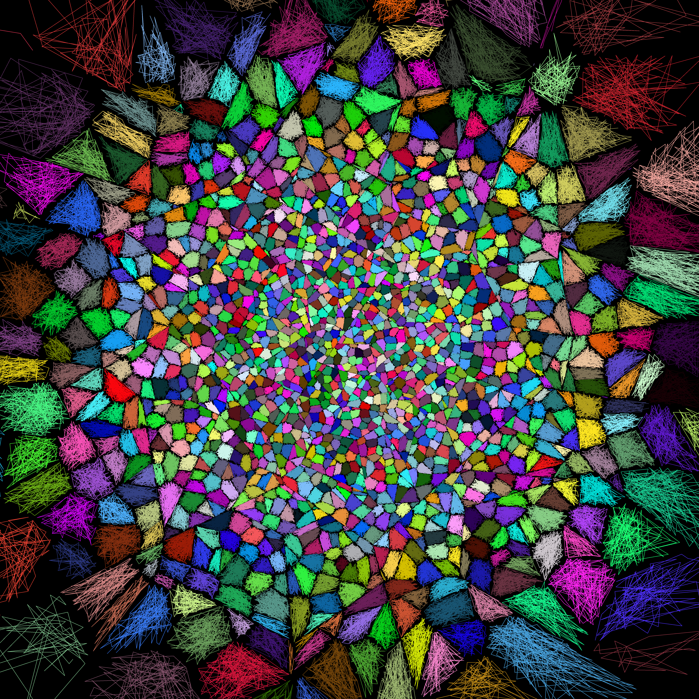

[](https://github.com/mitre-public/dist-tree/actions/workflows/gradle.yml)


Data inside each colored patch is retrieved in a single I/O operation. This pattern of "localized data access" extends
to high dimensional space.

# The DistanceTree Project

This project provides a _Scalable, Durable_ `DistanceTree`.

---

## What does a `DistanceTree` do?

> A `DistanceTree<K,V>` is a Key-Value store that allows you to find _similar_ Key-Value pairs in **high-dimensional datasets**.
>
> A `DistanceTree` can:
> - Perform **Range Searches:** `getAllWithinRange(K searchKey, double range)` (left side of graphic)
> - Perform **kNN Searches:** `getNClosest(K searchKey, int n)` (right side of graphic, k = 10)
> 
> All `DistanceTree<K,V>` searches return [SearchResults<K, V>](./src/main/java/org/mitre/disttree/SearchResults.java) 

### Example Searches:


Imagine _range_ and _knn_ searches like this, implemented efficiently, and applied to high dimensional data!

---

## Why this Project?

Prior to this project, multi-dimensional data was stored and searched using a
`MetricTree` [(see GitHub implementation here)](https://github.com/mitre-public/commons/blob/main/src/main/java/org/mitre/caasd/commons/collect/MetricTree.java).
Unfortunately, a `MetricTree` is **_just_** an in-memory data structure. This project adapts `MetricTree's`
implementation into a `DistanceTree` that can:

1. Store a dataset that cannot fit into memory.
2. Search a dataset that cannot fit into memory.
3. Persist data beyond the lifetime of a single JVM process.
4. Adopt the _data storage layer_ of their choice (e.g., local files on disk, DuckDB, PostgreSQL, cloud blob storage,
   etc.). Each _data storage layer_ will have different performance, durability, and dollar cost characteristics.

---

## Quick Start

- Adopting this Java library requires your project to be on Java 17 or later.
- The latest official release is version: `0.0.1`
- All official releases are available at Maven Central.

### 1 - Add this dependency to your project

GRADLE:
```
dependencies {
  implementation("org.mitre:dist-tree:0.0.1")
}
```

MAVEN:
```
<dependency>
    <groupId>org.mitre</groupId>
    <artifactId>dist-tree</artifactId>
    <version>0.0.1</version>
</dependency>
```

### 2 - Gather and Store a Dataset

``` 
// Building an DistanceTree starts with a TreeConfig
DistanceTree<LatLong, String> tree = TreeConfig.<LatLong, String>builder()
    .keySerde(latLongSerde())
    .valueSerde(stringUtf8Serde())
    .distMetric((a, b) -> a.distanceTo(b).inNauticalMiles())
    .buildTree();

// Gather the Key-Value data we want to store in the tree
List<LatLong> locations = loadBusinessLocations();
List<String> names = loadBusinessNames();
tree.addBatches(batchify(locations, names, 1_000));

// JVM is shutdown, but our dataset is persisted!
System.exit()
```

### 3 - Search the Dataset

```
// The next JVM loads the tree from the default DataStore
DistanceTree<LatLong, String> tree = TreeConfig.<LatLong, String>builder()
    .keySerde(latLongSerde())
    .valueSerde(stringUtf8Serde())
    .distMetric((a, b) -> a.distanceTo(b).inNauticalMiles())
    .buildTree();

// No manual data loading is necessary

// Perform a "range search"
LatLong searchKey = randomLatLong();
double searchRadiusNm = 0.5;
SearchResults<LatLong, String> businessesNearby = tree.rangeSearch(searchKey, searchRadiusNm);

// Perform a "knn search"
SearchResults<LatLong, String> fiveClosestBusinesses = tree.knnSearch(searchKey, 5);
```

Note: Searching Key-Value data in a `DistanceTree` does not **require** shutting down the JVM and building a new tree.
Searches can be performed on the same `tree` that received the original Key-Value batches. However, advanced
`TreeConfig` options can prohibit co-mingling data mutations (e.g. writes) and data searching (e.g. reads).

---

## What Types of Key Data Can a `DistanceTree` Search?

**In a nutshell:**

- If _you can measure the "distance" between two keys_, then a `DistanceTree` can efficiently search Key-Value pairs
  using their Keys.
- MITRE's [Commons Project](https://github.com/mitre-public/commons) contains multiple data types designed to integrate
  with this `DistanceTree` project.
    - These pre-built key-types include:`LatLong`, `LatLong64`, `LatLongPath`, `LatLong64Path`, `AltitudePath`, and
      `VehiclePath`, and `PathPair`.

### Key-types that lend themselves to use in a `DistanceTree`

- **Types derived from physical concepts**
  1. `LatLong` and `LatLong64`
      - These are _simple_ 2-d location measurements
      - DistanceMetric = `latLong1.distanceTo(latLong2).in(myFavoriteUnit);`
  2. `LatLongPath` and `LatLong64Path`
      - These are sequences of `LatLong` locations
       - The distance (e.g. difference) between any two paths can be measured.
       - This means we can easily search for "similar paths" using a `DistanceTree`
  3. `VehiclePath` data
       - These are sequences of 3d position data (e.g. (lat, long, alt)_1, (lat, long, alt)_2, (lat, long, alt)_3, ...)
       - The idea is the same as `LatLongPath`, but also with altitude data
  4. `PathPair` data
       - These are pairs of `VehiclePaths`
       - Use the similarity between "VehiclePath Pairs" to find safety events that share similar path dynamics
  5. `Audio Signals`
      - Compute the FFT of an audio signal
      - Distance function = "Earth mover distance(FFT_1, FFT_2)"


- **Types derived from _mathy_ concepts**
    1. `n-dimensional unit vectors`
        - If your keys are simple vectors it may make sense to use
          a [Vector Database](https://en.wikipedia.org/wiki/Vector_database)
    2. `Probabilty Mass Functions`
        - Use the [Kullback–Leibler Divergence](https://en.wikipedia.org/wiki/Kullback%E2%80%93Leibler_divergence) to
          measure the distance btw two PMFs.
    3. `Markov Transition Matrices`
        - An `n x n` Markov Transition Matrix is just `n` Probability Mass Functions.
        - The "distance" between any 2 markov matrices is the sum of `n` separate KL-Divergence measures (one for each
          pair of rows in the transition matrix).

---

## Data Durability Options

A DistanceTree stores Key-Value pairs (i.e. `Tuples`) and make those KV pairs searchable. The physical data storage
solution is represented by the `DataStore` interface. Different implementations of `DataStore` provide different levels
of speed, latency, and reliability.

There are two pre-packaged `DataStore` implementations. Select a DataStore, and receive the performance vs.
reliability trade-off that `DataStore` makes.  (Hopefully, more `DataStore` implementation will be coming soon.)

The available DataStores are:

- `DuckDbStore`: This is the default `DataStore` implementation.
    - **Pros:** [DuckDB](https://duckdb.org/) is a well adopted, open-source database system that runs "in-process" on
      locally stored data. DuckDB's core thesis is that modern computers are powerful enough that many database-ish
      tasks can now occur locally. The overhead and complexity of a remote, sharded, and replicated database may not be
      necessary. In other words, DuckDB is simple. And using DuckDB to persist data and manage I/O means DistanceTree
      users do not need to integrate with a separate data storage service (other than the local disk).
    - **Cons:** This `DataStore` does not benefit from reliability improving features like redundant components, data
      replication, and load balancing.
- `InMemoryStore`: This DataStore is fast. It does not perform I/O. All data is kept in memory.
    - **Pros:** Fast! Great for problems that do not need persistent data storage.
    - **Cons:** Does not persist data.

(**Note:** Currently, no pre-packaged `DataStore` is backed by a **truly** highly-reliable data storage system.
Implementing a `DataStore` backed by a more reliable data storage system is perfectly achievable. We have not
prioritized this task because DuckDb has been sufficient for our needs.)


---

## Documentation

- **Performance:** A discussion on how Tree Configuration choices can impact performance
  is [here](./docs/dimensions-of-performance.md).
- **Frequently Asked Questions:** are listed [here](./docs/FAQs.md).
- **What is a Metric Space?:** is discussion [here](./docs/metric-space-def.md)
- **Storing Nodes, Tuples, and Pages:** is discussed [here](./docs/nodes-and-pages.md).
- **Project Goals and Non-Goals:** are discussed [here](./docs/goals-and-nongoals.md).
- **Possible future optimizations:** Are discussed [here](./docs/future-optimizations.md).
- **Idea Graveyard:** Old and rejected ideas are discussed [here](./docs/idea-graveyard.md)
- **Open Source Release Process:** Our **manual(??!!)** release process is described [here](./docs/release-process.md), the script is [here](./scripts/bundle-for-publishing.sh).

---

## Contributing

Contributions are welcomed and encouraged. We are currently looking for contributions that:

- Implement any of these [future optimizations](./docs/future-optimizations.md)
- Add `DataStore` implementations backed by: `PostgreSQL`, `SQLite`, or other data storage platforms

---

## Highly Related Research

- ["M-tree An Efficient Access Method for Similarity Search in Metric Spaces"](https://www.vldb.org/conf/1997/P426.PDF)
    - The most relevant paper by Paolo Ciaccia, Marco Patella, and Pavel Zezula
- ["Indexing Metric Spaces with M-tree"](http://www-db.deis.unibo.it/research/papers/SEBD97.pdf)
    - By: Paolo Ciaccia, Marco Patella, and Pavel Zezula
- ["An implementation of the M-tree index structure for PostgreSQL using GiST](https://ieeexplore.ieee.org/stamp/stamp.jsp?tp=&arnumber=9119265)
    - By István Donkó, János M. Szalai-Gindl, Gergo Gombos, and Attila Kiss
- [Vantage-Point trees](https://en.wikipedia.org/wiki/Vantage-point_tree)
- [Binary space partition trees](https://en.wikipedia.org/wiki/Binary_space_partitioning)


## Related Research

- [PostgreSQL GiST extension](https://www.postgresql.org/docs/8.1/gist.html)
- [pgvector](https://github.com/pgvector/pgvector)
- [faiss](https://github.com/facebookresearch/faiss/wiki)
    - This repo contains links to many other academic references

---

## Legal Statements

- **Approved for Public Release; Distribution Unlimited. Public Release Case Number 25-1212.**
- **Copyright:** The contents of this project is copyright `The MITRE Corporation`. See details [here](COPYRIGHT) .
- **Open Source License:** This project is released under the Apache License Version 2.0. See details [here](LICENSE).
- **Data Rights Legend:** See details [here](DATA_RIGHTS).
