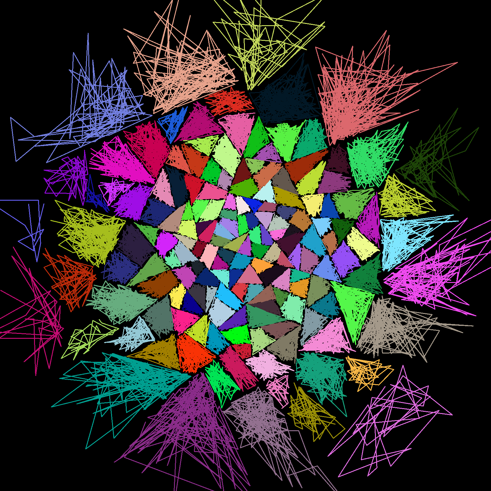

## Side Splitting

### BLUF

- "Side Splitting" has positives and negatives
  - **Good:** Reduces tree depth and fights tree imbalance by adding more nodes at the same depth level
  - **Good:** Enables building `DistanceTree` from the bottom up, rather than top down.
  - **Good:** Simplifies selecting `K centerpoint` used for routing queries and partitioning data.
  - **Bad:** Leaf nodes "overlap" in space!
- Must balance cost of repacking & rebalancing with the cost of deeper trees.

---

**Background:** When a `MetricTree` leaf node overflows it needs to be split. The question is "How should the node
be split?"  Should we:

- split "down" (i.e., add two new leaf nodes one level lower)
- or split "sideways" (i.e., add one new leaf node at the same level)

Traditional B-Tree literature tells you _"split sideways to minimize tree height and reduce I/O operations"_.

Unfortunately, data in a MetricTree cannot be rebalanced cheaply AND "side splitting" in a MetricTree produces
overlapping data pages (see figures below). In other words, if you side split your leaf nodes do not cleanly partition
the MetricSpace ... so searches will need to examine more data.

### Example of "Only using down splits".

### Example of "Using as many side splits as possible"

Note: You can mitigate the "overlap data page" issue by "finding large radius `DataPages`" and re-indexing all those
`Tuples` (i.e. redistributing that data). Big outliers will reduce the effectiveness of this mitigation

## Lesson Side-Splitting has downsides

**Problem** Side splitting DOES NOT cleanly partition a Metric Space.  In other words, if you are using "side-splitting" a Metric Space Key may be found in one or more leaf nodes.  This due to the fact that adding a "side-split" destroys a previously existing "partitioning plane".

- Before adding `node c` the data was partitioned by the plane _"is the Key closer to a or b?"_.
- After adding `node c` there may be a portion of space that is inside both node a's territory AND node c's territory.
- The impact on search performance will be unclear. On one hand searches may require fewer I/O operations because the
  tree is shallower. On the other hand searches may need to "scan" multiple data pages because the Metric space is no
  longer perfectly partitioned between leaf nodes.

## Lesson Side-Splitting has at least one MAJOR upside

**Benefit:** Side splitting prevent the risk of building an imbalnced tree!

- Side-splitting (e.g. dividing one "full" DataPage into 2 "half DataPages") enables building a tree from the ground up.
- When this is the only mechanism of splitting DataPages then inner nodes can be efficiently selected in a way that DOES
  NOT risk future tree-imbalance.
- Each time you side split you create a new Data Page and select one new `K centerpoint` that _anchors_ that page.
