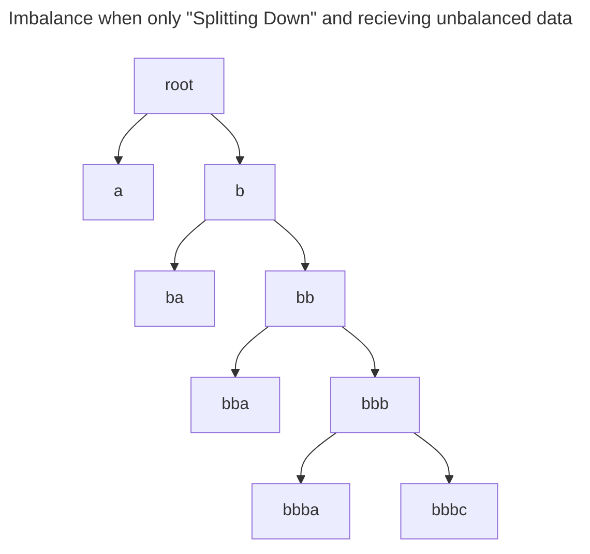
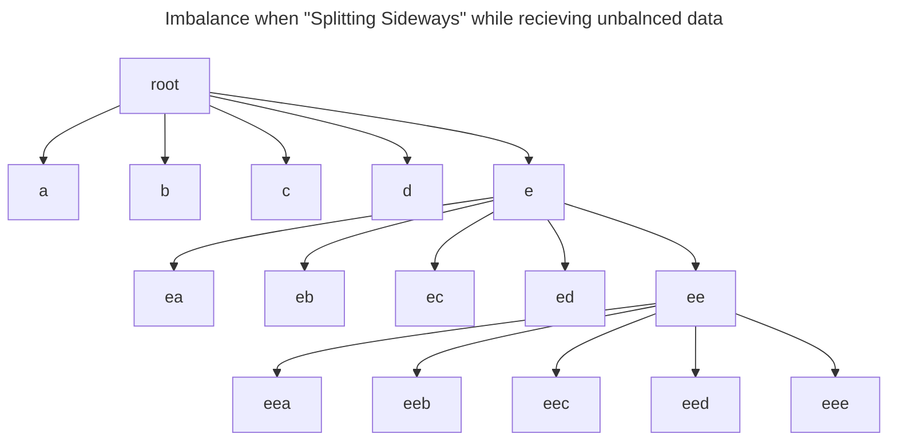
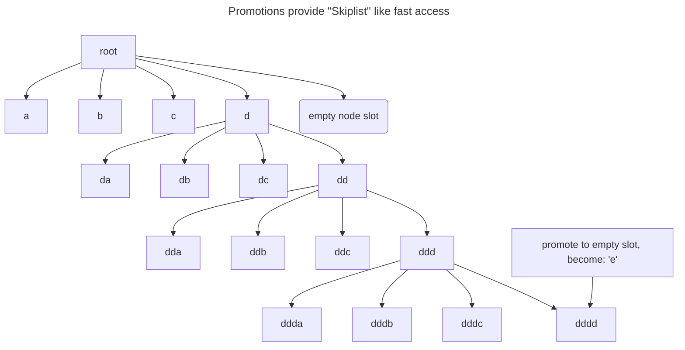

## Thoughts about Balancing an `DistanceTree`

### BLUF

- Best to "Split Sideways" and "grow upwards" to prevent imbalance
- Whenever you split a leaf node you **ALWAYS** introduce "space overlap"
- It is **UNCLEAR** how this space overlap impacts performance 
  - It probably has little to know impact at "tree creation time"
  - It may or may not substantially degrade tree searches
- Strategies to combat "space overlap" include:
  - Ignore it and just keep adding data ("space overlap" may shrink as leaves become more numerous)
  - Repacking leaf nodes that were "just split" (i.e. drain and reassign all the tuples in that node)
  - Repacking leaf nodes adjacent to those "just split"
  - Rebuild old leaf nodes **incrementally** (i.e., as batches are added)
  - Rebuild old leaf nodes **in bulk** (i.e., in a huge pass at the end of building a tree)
- Outcome: Tree is always balanced, Searches are always fast, Maintenance is amortized.

### Fact: Balancing an `DistanceTree` Requires More Computation

- When a DistanceMetric is computationally expensive then incremental rebalances will be computationally expensive and
  limit our ingest rate.
    - This is an important difference from a traditional B-Tree.
    - Traditional B-Trees can be easily balanced because the tuples are sorted in **one** dimension
    - Traditional B-Trees can be easily balanced because key comparisons are usually trivially cheap to execute.
    - I.e. it is easy to determine which tuples goto which child node.

### Fact: We can "repack" individual `DataPages`

- When a `DataPage` (i.e. leaf node) gets too full we can repack that node.
    - This process temporarily removes all the data from the leaf and re-adds it to the tree.
    - Usually, the majority of the `Tuples` go back to the same Leaf and a minority of the `Tuples` gets moved to a
      better leaf node.
    - Occasionally, an entire `DataPage` will be deleted during a repack operation!
    - This process also allows the radius of `DataPages` to shrink.

### Fact: Repacking `DataPages` can solve tree imbalance

- If we randomly select `DataPages` for repack during every transaction we will naturally grow a balanced tree!
- If we _wisely_ select `DataPages` that need repacking we can ensure a tree-balance with minimal execution costs

### Fact: The "worst case" `B-MetricTree` can be studied

- **How can we create the "least imbalanced" tree when the data "naturally creates imbalance"?**
    - For example, if the tree continuously accepts `(Lat, Long, Time)` tuples the tree may gradually grow imbalanced
      due to the ever-increasing time dimension.
    - How can we "reduce the impact" of ingesting imbalance data?

### Fact: Reindexing the tree will ALWAYS be possible

- If a tree becomes "very unbalanced" AND performance is "bad" we **always** have the option to re-index the tree.
- In this event we can just rebalance the whole tree using the random bits from the Entries `TimeId`s
    - These bits are always RANDOM, so it will help us pull a perfect random sample. And we know a random insert
      order will produce a decently balanced tree.

### Fact: There are a few "tree operations" to consider

- **Good Operations**
    - **Splitting Sideways:** Splits one leaf node into 2 leaf nodes. The new leaf nodes remain at the same tree-depth.
    - **Growing Up:** When an inner-node has too many children it must be split. When this occurs you add a new
      inner-node tree and redistribute the children.
    - IMPORTANT! This allows you to delay choosing the routing keys until we know the distribution of the Key data. In
      other words, "building upwards" ONLY AFTER the data has been added allows efficiently selecting the Keys we use
      for query routing.
    - **Node Repacking:** Prunes the data at a leaf node to verify those Tuples "should be" assigned to that particular
      leaf node (e.g. the best possible Leaf Node for a given `Tuple` can change during node splits). The heuristics
      used to select good candidates for node repacking are up for study. Currently, we only repack brand new DataPages.
      However, nodes with large radius values and **old nodes** are good candidates for repacking.
- **Deprecated Operations**
    - **Splitting down:** Converts a leaf node into an inner-node AND produces 2 new leaf nodes. The leaf nodes are "
      pushed
      down" one layer in the tree
    - **Node Promotion:** Take any node (and potentially its children) and move it up 1 or more layers in the tree
        - Two main problems: How do you choose when to promote? How do you recompute the reduced radius for the place
          this
          node was pulled from?

#### FACT: Splitting Down Leads to Imbalanced Trees

- _Splitting Down_ builds an imbalanced trees when the incoming data "naturally creates imbalance"
    - As we search (i.e., descend) the tree we essentially take **fixed step sizes** towards our target
    - The **step-size** is roughly the number of entries in a leaf node.

- **UPSIDE:** Produces Leaf nodes that cleanly partition the Metric Space (e.g. leaf node "spaces" do not overlap)
- **UPSIDE:** Does not reduce the number of available "node slots"
- **UPSIDE:** Adds space underneath for more "sideways splits"
- **DOWNSIDE:** Opens the door to needing more I/O ops

#### FACT: Splitting Sideways Softens Tree Imbalance

- _Splitting Sideways_ reduces imbalance by a **fixed ratio**.
    - As we search (i.e., descend) the tree we essentially take **fixed step sizes** towards our target
    - The **step-size** is roughly the _n_ times the number of entries in a leaf node (where _n_ = branching factor).

- **UPSIDE:** These splits increase tree density!
- **DOWNSIDE:** Produces Leaf nodes that DO NOT partition the Metric Space! E.g., leaf node "spaces" overlap!
- **DOWNSIDE:** Filling "node slots" with a side split eliminates a slot for promotion

#### Promotions Fundamentally alter runtime

- _Node Promotion_ can fundamentally change search times from O(n) to O(log(n)).
    - BUT, if we "promote too often" we'll lose our promised O(log(n)) performance because we degraded into essentially
      splitting sideways.
    - AND, if we "promote too often" we'll run out of promotion slots
    - THEREFORE, we have to promote somewhat rarely and sometime very far ...
    - CAVEAT: Make sure the aggregate promotion rate (across all down tree nodes) doesn't fill "high tier slots" too
      quickly
- Refer to skiplist implementations for help

- **UPSIDE:** Add shortcuts!  Makes search faster when data is skewed and imbalanced!
- **DOWNSIDE:** Promoting a node uses a non-renewable resource -- the empty "node slots" near the root of the tree
- **DOWNSIDE:** "Small jump promotions" may prevent future "Long jump promotions"

